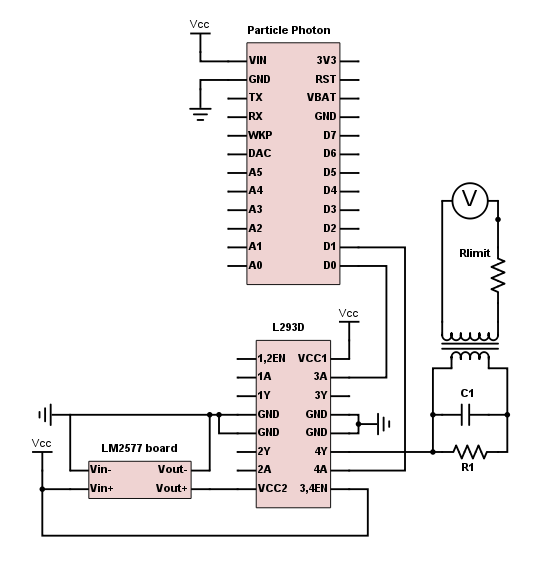

# Arduino-Like Telephone Ring Voltage Generator

This repository chronicles my project to build a telephone ring voltage generator using an Arduino-like microcontroller.  The goal is to generate a 90V AC signal at 20Hz.

This project went through many phases, which I've documented approximately in the history of this repository.
1. [Phase 1: Generate a simple 5V/20Hz square wave](https://github.com/jonscheiding/phone-ringer/tree/step-1)
2. [Phase 2: Boost the 5V/20Hz square wave to 18V](https://github.com/jonscheiding/phone-ringer/tree/step-2)
3. [Phase 3: Boost the 18V/20Hz square wave to 90V](https://github.com/jonscheiding/phone-ringer/tree/step-3)
4. **Phase 4: Make the ugly square wave into a nice sine wave**

### PARTS

These are the parts I used, with links.

- Particle Photon (http://a.co/5yvVv50)
- L293D Quadruple Half-H Bridge (http://a.co/hMpajMe)
- LM2577-based adjustable boost converter (http://a.co/huLOzfz)
- Step-up transformer ([details](Transformer.md))
- Capacitor and resistor for RC filter ([details](PWM.md))

### BUILD

The code looks like [this](phone-ringer.ino).  We're using [PWM](PWM.md) to approximate the positive half of a sine waveform on one of our h-bridge outputs, and then on the other one.  This is a little different than normal (i.e. mains) AC power, in that we don't have a "neutral" line that remains at ground potential and a "hot" that oscillates above and below.  Instead, our two lines take turns being the "hot".

The circuit looks like this:

Vcc should all be connected together and so should GND.  Right now, we're using the Micro USB connector on the Photon to actually power the whole thing, but we'll probably want to change that eventually.  We're using an [RC filter](PWM.md) to turn the PWM approximated sine wave into a real one.

Before building the circuit, you'll want to set the boost converter to an appropriate voltage.  An easy way to do this is to hook up the input to a couple of AA batteries, and connect a large resistor and your voltmeter to the output.  You can then turn the pot to set the voltage.  The correct voltage depends on the ratio of your step-up transformer.  For mine, I used a 1:5 transformer and set my boost converter to 18V.  See [The Step-Up Transformer](Transformer.md) for more details.

Notice that on the other side of the transformer, we've included a resistor `Rlimit`.  When off hook, the impedance presented by the phone is very low - reports vary but it is probably in the 500Ω range.  Driving this with 90V will cause a pretty high current, and make a loud buzzing from the earpiece speaker.  The `Rlimit` resistor prevents this.  You'll want to choose a resistor value that is much larger than 500Ω, but very much smaller than the on-hook impedance (which should be in the 5MΩ range).  I got good results using 10KΩ for `Rlimit`.

### RESULTS

Once you build this circuit and power it up, you should get a reading of around 60V on your voltmeter in AC mode.

At this point, you're ready to test the circuit with an actual phone!  Snip one end off of a phone cord, strip the two wires, and connect them to the plug side of your transformer.  If you plug the other end of the cord into a phone, it should ring!