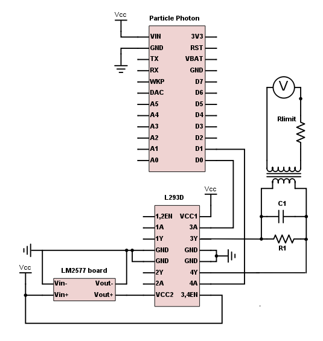

# Arduino-Like Telephone Ring Voltage Generator

This repository chronicles my project to build a telephone ring voltage generator using an Arduino-like microcontroller.  The goal is to generate a 90V AC signal at 20Hz.

This project went through many phases, which I've documented approximately in the history of this repository.
1. [Phase 1: Generate a simple 5V/20Hz square wave](https://github.com/jonscheiding/phone-ringer/tree/step-1)
2. [Phase 2: Boost the 5V/20Hz square wave to 18V](https://github.com/jonscheiding/phone-ringer/tree/step-2)
3. **Phase 3: Boost the 18V/20Hz square wave to 90V**

### PARTS

These are the parts I used, with links.

- Particle Photon (http://a.co/5yvVv50)
- L293D Quadruple Half-H Bridge (http://a.co/hMpajMe)
- LM2577-based adjustable boost converter (http://a.co/huLOzfz)
- Step-up transformer ([details](Transformer.md))

### BUILD

The circuit looks like this:

(Vcc's and GNDs should all be connected together.  You can use the Micro USB connector on the Photon to actually power the whole thing for now, but we'll probably want to change that eventually.)

The code looks like [this](phone-ringer.ino).  We're generating a push-pull square wave by alternately activating one or the other of the outputs on our h-bridge.  This is a little different than normal (i.e. mains) AC power, in that we don't have a "neutral" line that remains at ground potential and a "hot" that oscillates above and below.  Instead, our two lines take turns being the "hot".

Before building the circuit, you'll want to set the boost converter to an appropriate voltage.  An easy way to do this is to hook up the input to a couple of AA batteries, and connect a large resistor and your voltmeter to the output.  You can then turn the pot to set the voltage.  The correct voltage depends on the ratio of your step-up transformer.  For mine, I used a 1:5 transformer and set my boost converter to 18V.  See [The Step-Up Transformer](Transformer.md) for more details.

### RESULTS

Once you build this circuit and power it up, you should get a reading on your voltmeter in AC mode.  If it is a "true RMS" meter, it should read close to 90V.  Otherwise, the reading may be lower, or inconsistent.

At this point, you're ready to test the circuit with an actual phone!  Snip one end off of a phone cord, strip the two wires, and connect them to the plug side of your transformer.  If you plug the other end of the cord into a phone, it should ring!

If it sounds weird, don't worry.  We'll deal with that soon.