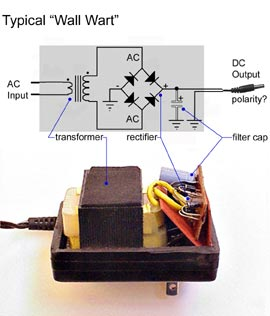

# Arduino-Like Telephone Ring Voltage Generator

This repository chronicles my project to build a telephone ring voltage generator using an Arduino-like microcontroller.

## GOAL: Generate 20Hz AC at about 90V

**PARTS:**
- Particle Photon
- L293D Quadruple Half-H Bridge
- LM2577-based adjustable boost converter (http://a.co/huLOzfz)
- Step-up transformer (see below)

Initially, let's just generate an AC square wave.  The circuit looks like this:

(Vcc's and GNDs should all be connected together.  You can use the Micro USB connector on the Photon to actually power the whole thing for now, but we'll probably want to change that eventually.)

The code looks like [this](phone-ringer.ino).  We're generating a push-pull square wave by alternately activating one or the other of the outputs on our h-bridge.  This is a little different than normal (i.e. mains) AC power, in that we don't have a "neutral" line that remains at ground potential and a "hot" that oscillates above and below.  Instead, our two lines take turns being the "hot".

### Boost Converter

Before building the circuit, you'll want to set the boost converter to an appropriate voltage.  An easy way to do this is to hook up the input to a couple of AA batteries, and connect a large resistor and your voltmeter to the output.  You can then turn the pot to set the voltage.  For now, I set mine to 18V - we may adjust this later.

### Transformer

Ideally, you'd choose a transformer that is designed to operate at 20Hz, but good luck finding one.  The easiest place to get a transformer is to hack it out of a wall-wart AC/DC adapter.

For my build, since I have set my boost converter to output 18V, and I want to step that up to 90V, I need a 1:5 transformer.  Since a wall AC adapter steps voltage down from 120V, a 5:1 transformer would output 24V.  If you can't find a 24V AC adapter, you can use a different ratio, and adjust the output of your boost converter appropriately.  You can calculate the appropriate value with this formula:

You ideally want an older AC adapter, without a lot of complex circuitry.  In my experience, 5V adapters were a lot more complex than your basic transformer-rectifier circuit, so I'd recommend avoiding those.  When you bust open the adapter, you should see something like this:

You want to desolder the transformer from the rest of the components.  You'll then connect the transformer "backwards", hooking the plug side to your voltmeter and wiring the other side to your h-bridge outputs.

### Results

Once you build this circuit and power it up, you should get a reading on your voltmeter in AC mode.  If it is a "true RMS" meter, it should read close to 90V.  Otherwise, the reading may be lower, or inconsistent.  The voltage may also be a bit lower than 90V, because:
1. We are operating the transformer at a much lower frequency than it was designed for
2. We are giving it a square wave, instead of the sine wave it's designed for

Both of these factors will tend to cause transformer core saturation, which is a complex phenomenon that I'm not going to attempt to understand beyond knowing that it reduces the transformer's output in a somewhat unpredictable way.

### Hooking it up!

At this point, you're ready to test the circuit with an actual phone.  Snip one end off of a phone cord, strip the two wires, and connect them to the plug side of your transformer.  If you plug the other end of the cord into a phone, it should ring!

If it sounds weird, don't worry.  We'll deal with that soon.