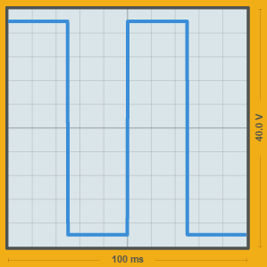

# Arduino-Like Telephone Ring Voltage Generator

This repository chronicles my project to build a telephone ring voltage generator using an Arduino-like microcontroller.

## GOAL: Generate 20Hz AC at about 90V

**PARTS:**
- Particle Photon
- L293D Quadruple Half-H Bridge
- Adjustable DC boost converter  
  I used this LM2577-based model: http://a.co/huLOzfz

### 1. Generate an AC square wave at 18V/20Hz

Initially, let's just generate a simple AC square wave.  The circuit looks like this:

(Vcc's and GNDs should all be connected together.  You can use the Micro USB connector on the Photon to actually power the whole thing for now, but we'll probably want to change that eventually.)

The code looks like [this](phone-ringer.ino).  We're generating a push-pull square wave by alternately activating one or the other of the outputs on our h-bridge.  This is a little different than normal (i.e. mains) AC power, in that we don't have a "neutral" line that remains at ground potential and a "hot" that oscillates above and below.  Instead, our two lines take turns being the "hot".

Before building the circuit, you'll want to set the boost converter to an appropriate voltage.  An easy way to do this is to hook up the input to a couple of AA batteries, and connect a large resistor and your voltmeter to the output.  You can then turn the pot to set the voltage.  For now, I set mine to 18V - we may adjust this later.

Once you build this circuit and power it up, you should get a reading on your voltmeter in AC mode.  If it is a "true RMS" meter, it should read 18V.  Otherwise, the reading may be lower, or inconsistent.  I don't have an oscilloscope, but if you hooked one up you would see something like this:

You can experiment with the voltage by setting FREQUENCY_HZ extremely low (e.g. around 0.1).  This should cause the voltage to switch back and forth slowly enough that you will be able to read it with your voltmeter in DC mode.