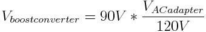
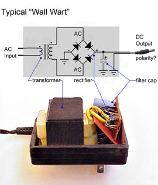

## The Step-Up Transformer

You might be asking, where the heck do I get a step-up transformer?  Ideally, you'd choose a transformer that is designed to operate at 20Hz, but good luck finding one.  The easiest place to get a transformer is to hack it out of a wall-wart AC/DC adapter.

For my build, since I have set my boost converter to output 18Vpeak, and I want to step that up to 90Vpeak, I need a 1:5 transformer.  Since a wall AC adapter steps voltage down from 120V, a 5:1 transformer would output 24V.  If you can't find a 24V AC adapter, you can use a different ratio, and adjust the output of your boost converter appropriately.  You can calculate the appropriate value with this formula:

You want an older AC adapter, without a lot of complex circuitry.  In my experience, 5V adapters in particular were a lot more complex than your basic transformer-rectifier design, so I'd recommend avoiding those.  When you bust open the adapter, you should see something like this:

You want to desolder the transformer from the rest of the components.  You'll then connect the transformer "backwards", hooking the plug side to your voltmeter and wiring the other side to your h-bridge outputs.

### NOTE

The final output voltage of this transformer, even assuming we've done our calculations right and set the boost converter properly, will probably be a bit lower than 90Vpeak (63Vrms).  This is because we are operating the transformer at a much lower frequency than it was designed for.  That will tend to cause transformer core saturation, which is a phenomenon that I'm not going to attempt to understand beyond knowing that it reduces the transformer's output in a somewhat unpredictable way.
